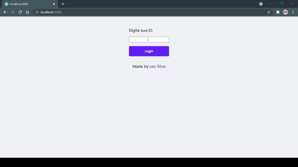
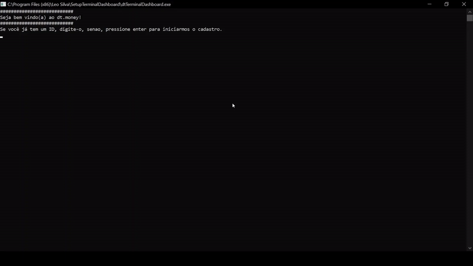

# dt.money


<!-- Alterar cover quando o projeto estiver 100% funcional -->


> Plataforma de acopanhamento de transações pessoais

O dt.money é uma plataforma de acopanhamento de transações pessoais. Conta com uma parte desktop e uma web. Seu design pode ser encontrado [aqui](https://www.figma.com/file/sfYqFZG6Y6247jAXiZWtIq/dtmoney?node-id=0%3A1)

## 🔎 Preview

Um pequeno preview de cada uma das aplicações

### 🖥️ Desktop



### 🌐 Web


## 🚀 Tecnologias

Foram usadas diversas tecnologias, visto que o intuito era integrar duas plataformas diferentes, desktop e web:

- [FaunaDB](https://fauna.com/): bando de dados responsável por armazenar as transações

### 🖥️ Desktop

- [.NET 5.0](https://dotnet.microsoft.com/download/dotnet/5.0): responsável por toda estrutura desktop

### 🌐 Web

- [Next.js](https://nextjs.org/): permite funções como SSR, SSG e rotas dinâmicas

## Requisitos

Os requisitos são diferentes dependendo do programa que for executado. No entanto, a tecnologia git é necessário nos dois.

- [Git](https://git-scm.com/)

### 🖥️ Desktop

- [.NET 5.0 Runtime](https://dotnet.microsoft.com/download/dotnet/5.0#:~:text=x86-,.NET%20Desktop%20Runtime%205.0.10,-The%20.NET%20Desktop)

### 🌐 Web

- [Yarn](https://yarnpkg.com/)
- [Next](https://nextjs.org/)

## Instalando o dt.money

Para instalar o dt.money no seu computador, siga estas etapas:

```bash
# No seu terminal, clone o projeto
$ git clone https://github.com/LeoUpperThrower4/dtmoney.git

# Entre na pasta...
$ cd dtmoney
```

### 🌐 Web

```bash
# Entre no diretório web
$ cd web

# Instale as dependências
$ yarn
```

```js
// O projeto faz uso de variáveis ambiente, para armazená-las, você deverá criar um arquivo .env na raiz do seu projeto
PRISMIC_API_ENDPOINT = seu_endpoint;
PRISMIC_ACCESS_TOKEN = sua_chave;
```

## ☕ Usando o dt.money

Para usar o dt.money, siga estas etapas:

### 🌐 Web

```bash
# Em '.../dtmoney/web', inicie o projeto
$ yarn dev
```

### 🖥️ Desktop

```bash
# Entre no diretório desktop
$ cd desktop

# Abra o arquivo dtmoney.sln no Visual Studio 2019
# Execute o projeto
```

## 📫 Contribuindo para o dt.money

> Sua contribuição é muito bem vinda! 😀

Para contribuir com o dt.money, siga estas etapas:

1. Bifurque este repositório.
2. Crie um branch: `git checkout -b <nome_branch>`.
3. Faça suas alterações e confirme-as: `git commit -m '<mensagem_commit>'`
4. Envie para o branch original: `git push origin dtmoney / <local>`
5. Crie a solicitação de pull.

Como alternativa, consulte a documentação do GitHub em [como criar uma solicitação pull](https://help.github.com/en/github/collaborating-with-issues-and-pull-requests/creating-a-pull-request).

## 📝 Licença

Esse projeto está sob licença MIT.
